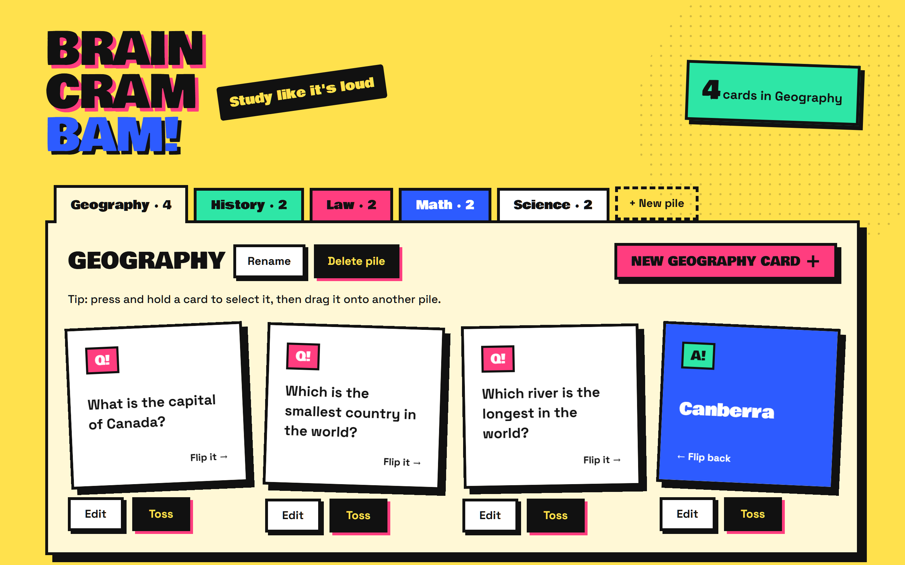
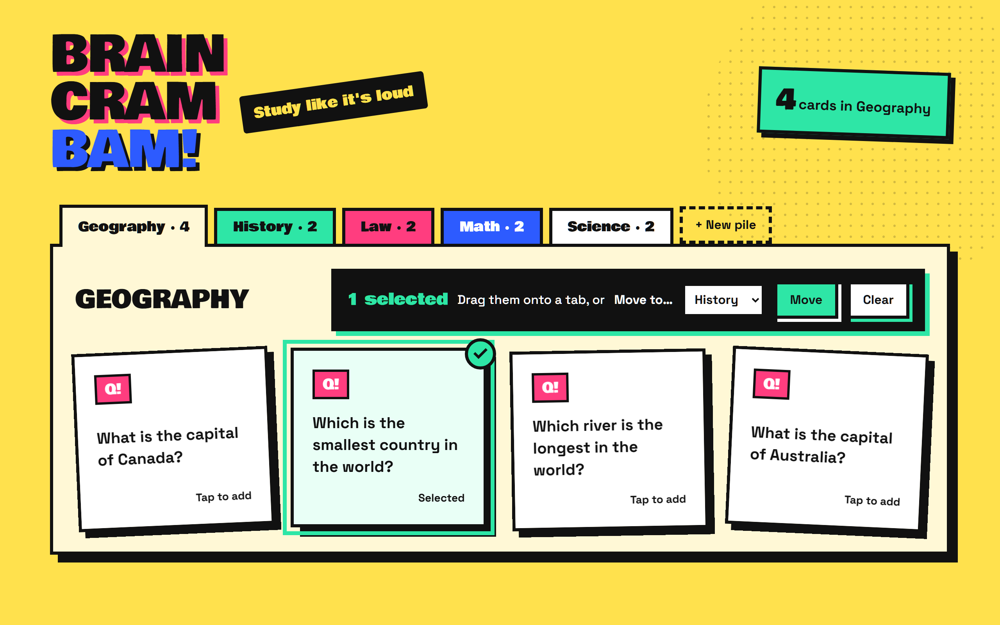

# BrainCramBam - Flash Card App

**Study like it's loud.**



Turn facts into flashcards and give your memory a workout. BrainCramBam
pairs a bold, comic-inspired look with a simple study flow: write a
question, flip for the answer, and keep each subject in its own pile.

## Features

### Flip to test yourself

Every card has a question on the front and the answer on the back. Click
a card to flip it, or tab to it and press Enter or Space. Say the answer
out loud first, then flip to check.

### Make your own cards

Open a pile and use the pink button in its header (**New Geography card**,
say) to add a card: type a question and an answer (up to 200 characters
each) and **Slam it in!**
Spotted a typo later? **Edit** changes a card right where it sits. **Toss**
deletes it, but only after asking "Toss it for real?"

### One pile per subject

Piles are the tabs above your cards: Geography, History, Law, whatever
you are studying. Each tab shows how many cards it holds, and a badge in
the corner counts the cards in the pile you have open. Add a pile with
**+ New pile**, and **Rename** or **Delete pile** from its header.

### Move cards between piles

Press and hold a card to select it, then tap more cards to add them.
Drag your selection onto another pile's tab (it says `Drop into ‹Name›`
while your cards hover over it), or pick a pile from **Move to…** and
press **Move**. Changed your mind? Press **Clear** or Esc. Once cards are
selected, **Move to…** also works with a keyboard and screen reader;
selecting them needs a press and hold for now.



### Deleting a pile doesn't have to lose your cards

If the pile still has cards, you choose: **Keep the cards** (they move to
a General pile) or **Delete the cards too**.

### Saved on your computer

Your piles and cards are stored in a local SQLite database, so they are
still there next time. The first time you run the app it comes with a
sample deck (Geography, History, Law, Math and Science) to play with.

## Quick start

Install a current Node.js LTS release with npm, then run these commands
from the project root:

```sh
npm install
npm run dev
```

Open http://localhost:5173. The API runs on http://localhost:3001.
The database is created automatically at `server/flashcards.db`, and
an empty database is populated with the sample piles and cards. Upgrading
from a version without piles? On first start, the cards already in
your database move into a new "General" pile.

## Good to know about piles

- **General** is the catch-all: kept cards from a deleted pile move there (it is
  created when missing).
- **Unsorted** only holds cards left over when General itself is deleted. Its
  tab only shows up while it has cards.
- Pile names are 1–40 characters and must be unique, ignoring upper and
  lower case.
- With no piles at all (say, after deleting every one), the app asks you
  to make a pile before your first card.

## For developers

Built with React, Vite, Tailwind CSS, Express, and Sequelize on SQLite.

Run the checks:

```sh
npm run lint
npm test
npx playwright install chromium
npm run e2e
```

The server's routes are listed in the [API reference](docs/api.md).
